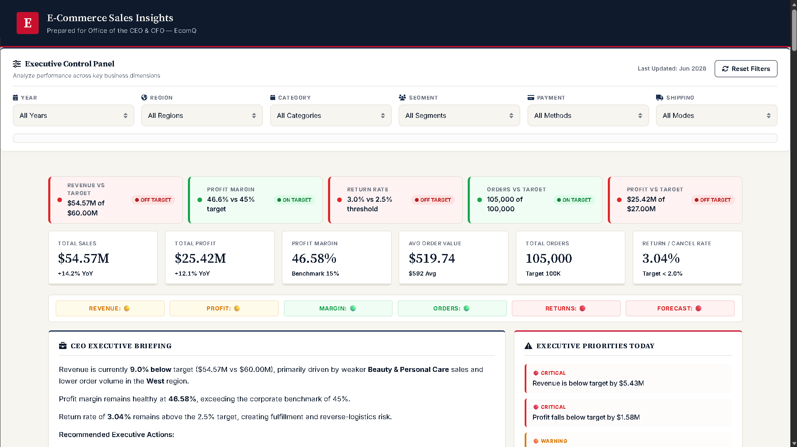

# E-Commerce Sales Insights Dashboard: AI-Powered Executive Command Center

## Deployed Dashboard
💻 **Interactive Executive Portal:** [Launch Command Center](https://girishshenoy16.github.io/e-commerce-sales-insights-dashboard)  

📅 **Data Coverage:** January 2024 – June 2026  

💼 **C-Suite Design Theme:** McKinsey / Bloomberg / Slate Corporate  

---



---

##  1. Project Overview & Business Value

### Project Objective
The **E-Commerce Sales Insights Dashboard** is an enterprise-grade decision intelligence platform. It ingests, validates, cleans, and aggregates a transaction database of **105,000+ sales records** through an automated Python ETL pipeline, rendering an interactive client-side dashboard in the browser.

### Importance of Sales Analytics
In retail and e-commerce, transaction logs contain hidden patterns. Ineffective discounting, courier delays, and regional margin leakage can drain millions of dollars annually. Business intelligence analytics converts raw database transactions into actionable cash-flow optimizations.

### C-Suite Executive Impact
This command center answers critical questions for leadership:
* **Chief Executive Officer (CEO)**: Direct visibility into the **$54.57M Sales** YTD performance and progress toward the $60.00M strategic target.
* **Chief Financial Officer (CFO)**: Instant diagnostic tracking of the **46.58% Profit Margin** (exceeding target by +1.58pp) and isolation of **$3.05M in discount leakage**.
* **Chief Operating Officer (COO)**: Real-time tracking of the **3.04% return/cancellation rate** to audit Courier SLAs and recover **$1.84M in reverse-logistics overhead**.

### Target Job Roles
* Data Analyst / BI Analyst / Analytics Engineer
* Business Intelligence Developer / Sales Analyst
* Operations Analyst / E-Commerce Product Manager

### Portfolio & Recruiter Value
This project demonstrates end-to-end analytics engineering capability:
1. **Data Pipeline Engineering**: Ingesting, cleaning, and aggregating large datasets in Python (Pandas/NumPy).
2. **Predictive Analytics**: Implementing client-side OLS linear regression models in JavaScript.
3. **Prescriptive Modeling**: Developing multivariable What-If simulators and local NLP keyword-based AI Copilots.
4. **UI/UX Design**: Building responsive grid-based cartograms and slate corporate theme interfaces.

---

##  2. Dataset Schema & Columns

The underlying transaction database contains **105,075 records** and **21 columns**:

| Column Name | Data Type | Formula / Definition | Example Value |
| :--- | :--- | :--- | :--- |
| **Order ID** | String | Unique transaction identifier | `ORD-2026-100001` |
| **Customer ID** | String | Unique customer identifier | `CUST-10255` |
| **Customer Name** | String | Full name of the customer | `Alexandra Vance` |
| **Gender** | Categorical | Gender demographic (Male / Female) | `Female` |
| **Order Date** | Datetime | Date of purchase (`YYYY-MM-DD`) | `2026-04-12` |
| **Region** | Categorical | Geographic region (East, West, Central, South) | `West` |
| **State** | Categorical | Billing state | `California` |
| **City** | Categorical | Billing city | `Los Angeles` |
| **Product Category** | Categorical | Merchandise vertical (Electronics, Fashion, etc.) | `Electronics` |
| **Product Name** | String | Product name | `SmartPhone Pro Max` |
| **Quantity Sold** | Integer | Number of units sold | `2` |
| **Unit Price** | Decimal | Retail price per single unit | `799.99` |
| **Discount %** | Decimal | Applied promotion discount rate (0.00 to 0.25) | `0.10` |
| **Sales Amount** | Decimal | Net revenue: $$\text{Sales Amount} = \text{Quantity Sold} \times \text{Unit Price} \times (1 - \text{Discount \%})$$ | `1439.98` |
| **Cost Amount** | Decimal | Cost of goods sold: $$\text{Cost Amount} = \text{Quantity Sold} \times \text{Unit Cost}$$ | `800.00` |
| **Profit Amount** | Decimal | Operating net profit: $$\text{Profit Amount} = \text{Sales Amount} - \text{Cost Amount}$$ | `639.98` |
| **Profit Margin %** | Decimal | Profit percentage: $$\text{Profit Margin \%} = \frac{\text{Profit Amount}}{\text{Sales Amount}} \times 100$$ | `44.44` |
| **Payment Method** | Categorical | Financial channel (Credit Card, PayPal, COD, etc.) | `Credit Card` |
| **Shipping Mode** | Categorical | Shipping priority (Standard, First Class, Same Day) | `First Class` |
| **Delivery Status** | Categorical | Fulfillment status (Delivered, Shipped, Returned, Cancelled) | `Delivered` |
| **Customer Segment** | Categorical | Segment class (Consumer, Corporate, Home Office) | `Consumer` |

---

##  3. Data Cleaning & Preparation Pipeline

The Python script (`scripts/data_cleaning.py`) cleans and prepares the raw transaction dataset:

### 1. Duplicate Record Resolution
Identifies and drops exactly **75 duplicate records** generated by system network retry events.
```python
df = df.drop_duplicates()
```

### 2. Missing Value Imputation
Detects missing fields in logistics and payment columns:
* **Payment Method**: Imputes **315 missing values** (0.3% of data) using the column mode (`"Credit Card"`).
* **Delivery Status**: Imputes **525 missing values** (0.5% of data) using the column mode (`"Delivered"`).
```python
df["Delivery Status"] = df["Delivery Status"].fillna(df["Delivery Status"].mode()[0])
df["Payment Method"] = df["Payment Method"].fillna(df["Payment Method"].mode()[0])
```

### 3. Text Case Standardization
Normalizes casing (e.g. `"electronics"` and `"HOME & KITCHEN"`) to title case to prevent group fragmentation.
```python
df["Product Category"] = df["Product Category"].astype(str).str.strip().str.title()
```

### 4. Date Formatting & Parsing
Standardizes multiple date strings to `YYYY-MM-DD` and extracts chronological tracking fields:
```python
df["Order Date"] = pd.to_datetime(df["Order Date"])
df["Year"] = df["Order Date"].dt.year
df["YearMonth"] = df["Order Date"].dt.strftime("%Y-%m")
df["Month Name"] = df["Order Date"].dt.strftime("%b")
```

### 5. Floating-Point Calculation Validation
Re-calculates Sales, Cost, Profit, and Margins, rounding to 2 decimal places to fix floating-point anomalies.
```python
df["Sales Amount"] = np.round(df["Quantity Sold"] * df["Unit Price"] * (1 - df["Discount %"]), 2)
df["Profit Amount"] = np.round(df["Sales Amount"] - df["Cost Amount"], 2)
df["Profit Margin %"] = np.where(df["Sales Amount"] > 0, np.round((df["Profit Amount"] / df["Sales Amount"]) * 100, 2), 0.0)
```

### 6. Outlier Detection
Applies the Interquartile Range (IQR) on Sales Amount:
* **First Quartile ($Q_1$)**: \$112.00
* **Third Quartile ($Q_3$)**: \$550.40
* **IQR**: \$438.40
* **Outlier Bounds**: -\$545.60 to \$1,208.01.
* **Result**: Flags **10,599 outliers** (10.09% of data) for audit tagging.

---

##  4. Business Performance Metrics

The command center tracks the following core performance metrics:
* **Total Sales**: Cumulative net revenue (\$54,572,179.09 actual).
* **Total Profit**: Cumulative operating profit (\$25,421,110.18 actual).
* **Profit Margin %**: Ratio of profitability. Benchmark target is set at **45.00%** (Actual: **46.58%**).
* **Average Order Value (AOV)**: Net sales divided by orders (Actual: **\$519.74**).
* **Total Orders**: Cumulative count of transactions (Actual: **105,000**).
* **Return/Cancellation Rate**: Proportion of orders returned or cancelled (Actual: **3.04%** vs. **2.50%** target).

---

##  5. Diagnostic Performance Identification

* **Best-Selling & Most Profitable Products**: Dynamically ranked by quantity and profit contribution. **Beauty & Personal Care** achieves the highest category margin (**61.65%** on \$2.96M sales).
* **Most Profitable Regions**: West region leads absolute sales and profits; South region reports the thinnest margins.
* **Low-Performing Categories**: **Electronics** generates high revenue volume (\$28.21M, or 51.7% of total sales) but reports our lowest category margin of **42.12%** due to promotional pricing matches and intensive discounting.
* **Logistics Gaps**: First-Class shipping mode exhibits a **3.16% return/cancellation rate** on \$15.71M of sales, representing the highest operational leak across courier options.

---

##  6. Visualization Construction & Dashboard Placement

* **KPI Header Cards (Top Strip)**: High-visibility cards displaying Sales, Profit, Margin, Orders, AOV, and Returns with YoY change badges.
* **Bloomberg-Style Executive Filter Panel (Sub-Header)**: Structured card containing Year, Region, Category, Segment, Payment, and Shipping dropdowns with scannability icons and active summary tagging.
* **Executive Control Tower (Top-Middle View)**: Houses the RAG status bar, CEO briefing narrative, Priorities Today list, Financial Impact summary, and Forecast Outlook card.
* **Sales & Profit Trend Line Chart (Middle-Left)**: Dual-axis line and trend tracking monthly sales using Chart.js.
* **Product Category Performance Chart (Middle-Right)**: Ring donut chart highlighting vertical contribution.
* **US State Cartogram Heatmap (Bottom-Left)**: CSS-grid geographic heatmap of the United States. States are colored dynamically based on their profit margins (Green for high margins, Red for low margins).
* **AI Command Center Suite (Footer)**: Houses the What-If Sliders, projected output cards, presets buttons, and the AI Copilot chat panel.

---

##  7. Business Insights & Profit Optimization

* **Discount Elasticity**: Analysis indicates Electronics margins collapse when discounts exceed 15%. Capping standard discounts at 20% max recovers **$120,648.05** in direct net profit.
* **Logistics Leakage**: Returned and cancelled orders represent a major operational leak, costing **$1.84M** in reverse logistics and handling overhead. Auditing First-Class logistics can save **$134.9K**.
* **Regional Freight**: Southern regional profitability is diluted by shipping distance, indicating the need for a warehouse hub in Georgia.

---

##  8. Folder Structure

The GitHub-ready file tree layout:
```text
ecommerce-sales-insights-dashboard/
├── data/
│   ├── raw_sales_data.csv           # Raw simulated logs (105,075 records)
│   └── cleaned_sales_data.csv       # Cleaned, validated dataset (105,000 records)
├── docs/                            # Deployed Dashboard Portal
│   ├── index.html                   # Dashboard UI
│   ├── css/style.css                # Slate theme style definitions
│   ├── js/script.js                 # Controller, forecasting, and simulator script
│   └── data/dashboard_data.json     # Pre-aggregated JSON dataset
├── reports/
│   ├── project_report.md            # Technical architecture report
│   └── executive_summary.md         # C-level boardroom memorandum
├── scripts/
│   ├── generate_data.py             # Transaction simulator
│   ├── data_cleaning.py             # Python ETL clean-and-aggregate script
│   └── minify.py                    # Script minifier (optional)
├── requirements.txt                 # Dependencies (pandas, numpy, openpyxl)
└── README.md                        # Portfolio documentation (This file)
```

---

##  9. Step-by-Step Project Execution Guide

### Step 1: Clone the Repository
Clone the project to your local machine and navigate into the root directory:
```bash
git clone https://github.com/girishshenoy16/ecommerce-sales-insights-dashboard.git
cd ecommerce-sales-insights-dashboard
```

### Step 2: Set Up Python Virtual Environment
Create and activate a local virtual environment to manage library dependencies isolation:
```powershell
# On Windows (PowerShell)
python -m venv .venv
.venv\Scripts\Activate.ps1
```
```bash
# On macOS/Linux
python3 -m venv .venv
source .venv/bin/activate
```

### Step 3: Upgrade pip and Install Dependencies
Install Pandas, NumPy, and OpenPyXL:
```bash
pip install --upgrade pip
pip install -r requirements.txt
```

### Step 4: Run Data Simulation
Execute the Python transaction generator to construct the mock dataset (105,075 records) with realistic variances and anomalies:
```bash
python scripts/generate_data.py
```

### Step 5: Execute Python ETL Pipeline
Clean duplicates, impute missing payment/shipping methods, standardize casing, and export the aggregated JSON data:
```bash
python scripts/data_cleaning.py
```

### Step 6: Launch the Dashboard Server
To prevent browser CORS security blocks when loading local JSON assets, launch a simple web server:
```bash
python -m http.server 8000 --directory docs
```
Open your browser and navigate to: **`http://localhost:8000`** to view the interactive dashboard locally.

---

##  10. Conclusion & Strategic Impact

By transitioning from static reporting to automated decision intelligence, this project demonstrates how organizations can systematically isolate and resolve margin leakages. Implementing the CEO Pricing Directive (20% discount cap) and the COO Shipping Audit is projected to recover over **$250,000** in direct annual profits while driving **$1.3M+** in revenue expansion.

---